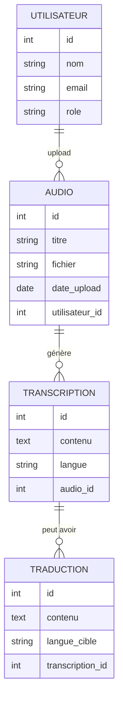

# 🎤 Oral2Text - Audio, Transcription et Traduction

## 📖 Description du projet
Ce projet consiste à développer une plateforme basée sur **Omeka S** permettant :
- L’**archivage de fichiers audio** (témoignages, interviews, patrimoine oral).
- La **transcription automatique** des fichiers audio en texte grâce à une API d’IA.
- La **traduction multilingue** des transcriptions selon la langue choisie par l’utilisateur.
- L’**organisation, la recherche et la diffusion** de ces contenus pour les étudiants, chercheurs, touristes et communautés locales.

Ce projet combine **technologies web, bases de données, IA et gestion documentaire** pour valoriser le patrimoine oral et faciliter l’accès multilingue aux ressources.

---

## 👥 Public cible
- **Étudiants** : pour l’apprentissage des langues et l’accès à des corpus oraux.
- **Chercheurs** : pour les humanités numériques, la linguistique, l’ethnographie.
- **Touristes** : pour comprendre des récits et informations culturelles dans leur propre langue.
- **Communauté locale** : pour préserver et partager leur patrimoine oral.

---

## 🛠️ Technologies utilisées

### Front-End
- HTML / CSS / JavaScript
- React
- Bootstrap (interface responsive)

### Back-End
- PHP (intégration Omeka S)
- Framework Omeka S

### Base de données
- MySQL / MariaDB
- RDF / Turtle (description sémantique, alignement Omeka S)

### API & Services
- REST API ✅
- OAuth2 ✅ (authentification des utilisateurs)
- API de transcription audio → texte (ex. Whisper d’OpenAI)
- API de traduction (ex. Google Translate, DeepL)

### Données & multimédia
- JSON
- XML
- Lecteur audio intégré

### Outils & environnements
- Git / GitHub
- XAMPP (serveur local PHP/MySQL)

### Autres technologies
- IA / NLP (reconnaissance vocale et traduction automatique)
- CMS : Omeka S

---

## ✨ Fonctionnalités prévues
- 🔍 Moteur de recherche (dans transcriptions et traductions).
- 📤 Formulaire d’upload (ajout de fichiers audio).
- 📊 Dashboard (administration et gestion des contenus).
- 🗂️ Filtres et tris (par langue, auteur, date, type de contenu).
- 🎧 Galerie multimédia (audio + transcription + traduction).
- ⬇️ Exportation (télécharger transcription ou traduction en PDF/Word).
- 🌍 Accessibilité renforcée (contenu multilingue).
- 🤖 IA intégrée (transcription et traduction automatiques).

---

## 📐 Diagramme entité-relation

## Prompt utilisé pour le diagramme
### Chat OpenAI

J'aurais besoin que tu m'intègres un diagramme "entité-relation" correspondant à mon projet fait avec Mermaid. Voici mon projet :

🎤 **Oral2Text** est une plateforme web basée sur **Omeka S** qui permet d’archiver des fichiers audio (témoignages, interviews, patrimoine oral), de les **transcrire automatiquement en texte** via une API d’IA, et de **traduire** ces transcriptions dans la langue choisie par l’utilisateur. 

Le projet utilise **HTML, CSS, JavaScript, PHP, MySQL, RDF/Turtle**, ainsi que des **API REST** pour la transcription et la traduction. Il s’adresse aux **étudiants, chercheurs, touristes et communautés locales** pour faciliter la **préservation et la diffusion multilingue** du patrimoine oral.
